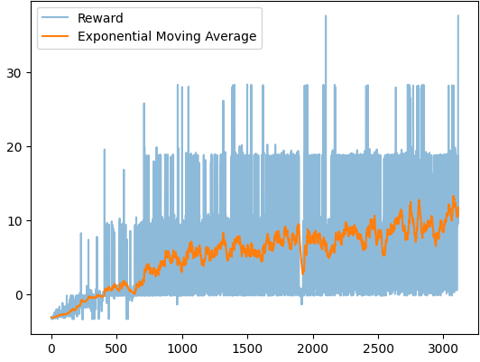
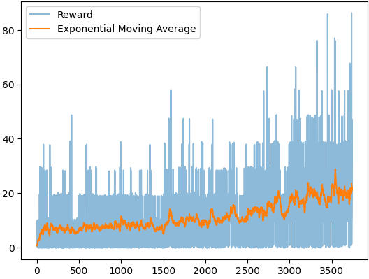

# Reinforcement Learning Algorithms
This repository contains implementations of various reinforcement learning (RL) algorithms, designed for clarity and ease of understanding.
- **`environment.py`**: Defines the environment used by all algorithms.
- **`model<name>.py`**: Contains the agent, model, and algorithm implementation.
- **`train<name>.ipynb`**: Manages the training process.

## 1. Flappy Bird
Implemented similar-structure models with A2C and PPO algorithms. Both models performed similarly (no significant changes), and stopped learning around an average score of 4, peaked 17 (15,000 episodes). The issues may be accused from feature engineering.
- **A2C (Advantage Actor-Critic)** using `tf.keras`  
> First 3000 episodes train on A2C  

- **PPO (Proximal Policy Optimization)** using `tf.keras`  
> Next 3000 episodes train on PPO  

